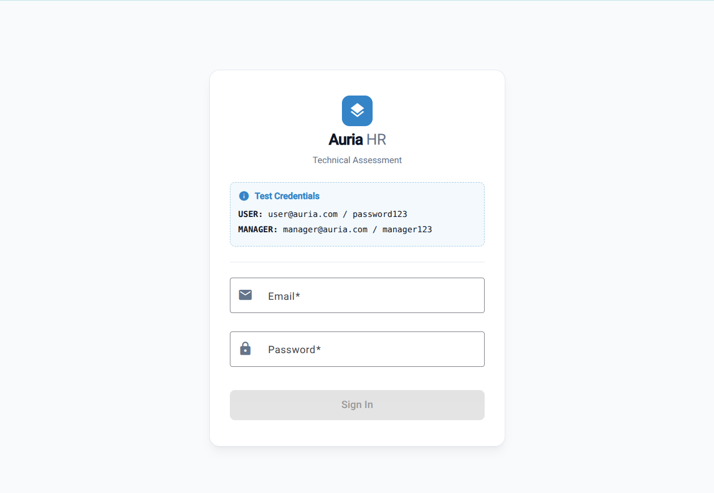
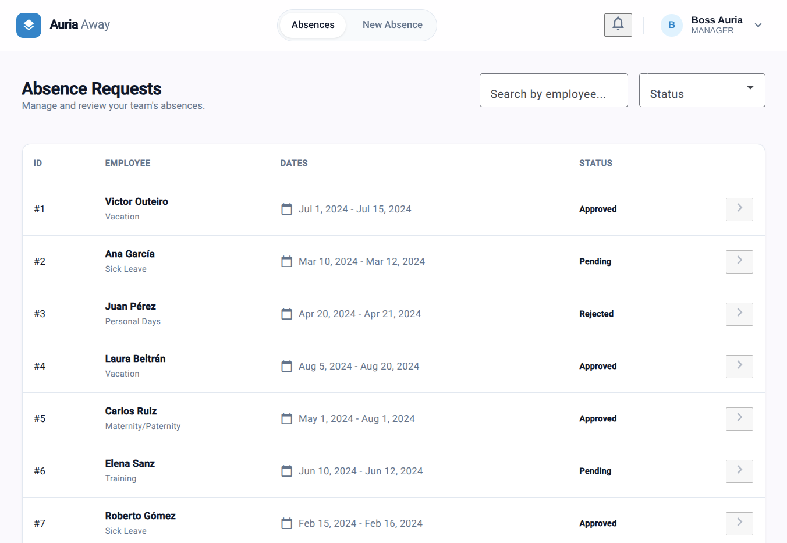
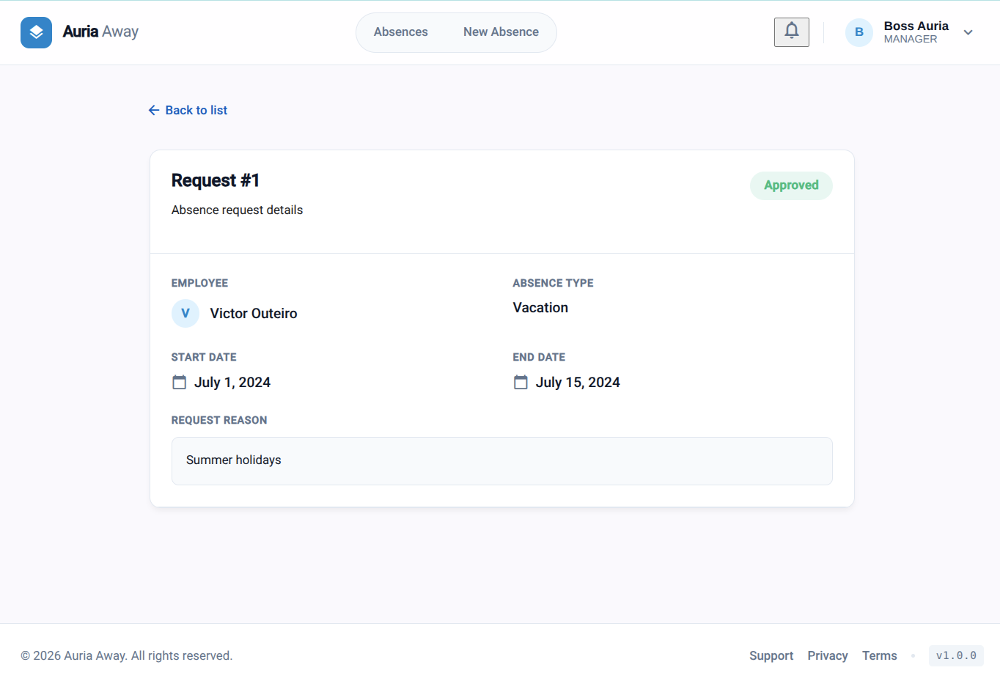

# Absence Control - HR Management System


This repository contains a robust **Absence Management System** developed as a comprehensive technical project to demonstrate advanced Frontend capabilities. Developed by **Victor Outeiro**.

## 1. Project Goal

The main objective was to build a high-performance Single Page Application (SPA) using Angular to manage employee absence requests. Key features include:

- **Advanced Management:** Absence listing with complex filtering and pagination.
- **Detailed Views:** Deep-dive into specific request details.
- **Dynamic Forms:** Creation of new requests with real-time validation.
- **Role-Based Access Control (RBAC):** Simulated security profiles for `USER` and `MANAGER`.
- **Route Protection:** Implementation of Angular Guards to secure the application state.

## 2. Technical Stack & Requirements

- **Framework:** Angular 17+ utilizing **Standalone Components**.
- **UI Library:** **Angular Material** for standardized, accessible, and responsive components.
- **Forms:** **Reactive Forms** with custom validation logic.
- **Routing:** Feature-based routing with **Lazy Loading** for performance optimization.
- **Reactive State Management:** Deep implementation of **RxJS** (using `combineLatest`, `switchMap`, `BehaviorSubject`, and `tap`).
- **HTTP Handling:** - `token.interceptor`: Automatically injects a simulated JWT token into requests.
  - `error.interceptor`: Globally handles HTTP errors (401, 403, 404, 500) and triggers non-intrusive UI notifications (Snackbars).

## 3. Architecture & Technical Decisions

The application logic is decoupled into two main domains: **Authentication** and **Absence Management**.

- **Mock Backend (JSON Server):** Chosen for its flexibility to provide a full REST API simulation, allowing for native filtering, sorting, and pagination.
- **Reactive Paradigm:** I deliberately chose **RxJS** over Angular Signals for core logic to showcase proficiency in handling complex asynchronous data streams and side-effects.
- **Performance:** Implemented Lazy Loading at the route level to ensure minimal initial bundle size, separating the Authentication flow from the main Dashboard.
- **Design Pattern:** Usage of the **Smart/Dumb Components** pattern to separate data fetching (services) from UI presentation (components).

## 4. Best Practices

- **Industry Standards:** Entire codebase, variable naming, UI, and commit history are in **English**.
- **Version Control:** Followed **Git Flow** and **Conventional Commits** (`feat:`, `fix:`, `refactor:`) to maintain a clean and professional repository history.
- **Clean Code:** Strong emphasis on DRY (Don't Repeat Yourself) and SOLID principles.

## 5. Installation & Setup

### Prerequisites

Ensure you have **Node.js** and **Angular CLI** installed.

### Step 1: Clone the repository

```bash
git clone [https://github.com/your-username/absence-control.git](https://github.com/your-username/absence-control.git)
cd absence-control
```

### Step 2: Install dependencies

```bash
npm install
```

### Step 3: Launch the Mock Backend (Required)

```bash
npx json-server --watch db.json --port 3000
```

The application will be available at http://localhost:4200.

**Demo Credentials**:

- **User Role**: user@example.com / password123
- **Manager Role**: manager@example.com / manager123

## 6. Testing the Global Error Interceptor

The application features a global interceptor to handle failures gracefully. You can test it by:

### Network Error (Status 0)

Stop the json-server while the app is running and try to perform a search.

### Not Found (Status 404)

Temporarily change the API URL in absence.service.ts to an invalid endpoint. (ej: http://localhost:3000/ruta-falsa).

## 7. Screenshots





## 8. Learning Outcomes & Challenges

This project served as a benchmark for refining several key skills:

- **RBAC Logic**: Implementing conditional UI behavior and route restrictions based on user profiles (USER vs MANAGER) using centralized Auth Services and Guards.

- **Efficiency under pressure**: Delivering a high-quality codebase with a comprehensive feature set within a tight timeframe, requiring disciplined architectural planning.

## 9. Acknowledgments

Special thanks to the mentors who have guided my path as a software developer:

Alejandro R. - My instructor at The Bridge Bootcamp.

Inmaculada Contreras - Instructor at Avante Professional Certification.

Jose María - Founder of Insinno and my internship tutor, for providing my first opportunity in a professional environment.
